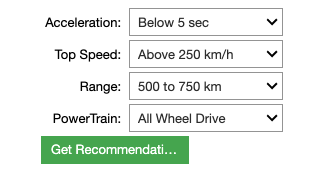
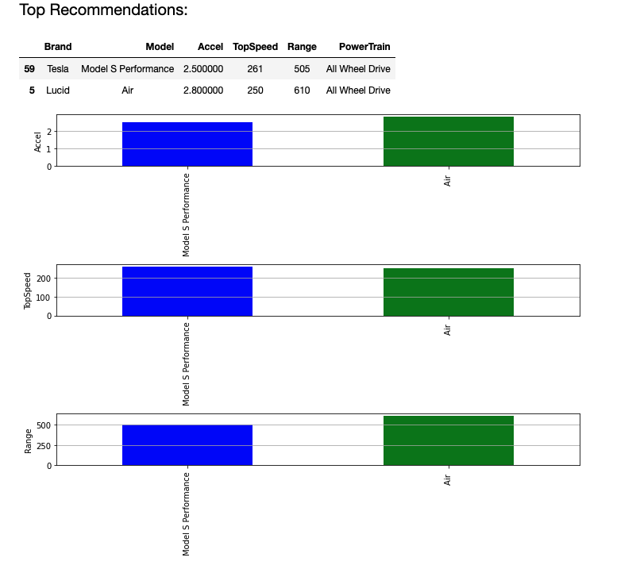

---

## Electric Car Recommendation System 🚗⚡

Welcome to the Electric Car Recommendation System! This interactive tool helps you find the best electric car models based on your preferences.

### Features 🌟

- **Interactive Dropdowns**: Easily specify your desired acceleration, top speed, driving range, and powertrain type.
- **Dynamic Recommendations**: Get the top 2 car models that best match your criteria.
- **Visual Comparisons**: See side-by-side bar plots comparing the attributes of the recommended cars.

### How It Works 🛠️

1. **Select Your Criteria**:
   - Choose an acceleration range (e.g., "5 to 7 seconds").
   - Pick a top speed range (e.g., "150 to 200 km/h").
   - Specify a driving range (e.g., "250 to 500 km").
   - Select the desired powertrain (e.g., "All Wheel Drive").

2. **Get Recommendations**:
   Click the "Get Recommendations" button, and voilà! You'll see the top 2 car models tailored to your preferences.

3. **Visual Insights**:
   Dive deeper with bar plots comparing the acceleration, top speed, and driving range of the recommended cars.

### Installation & Usage 🚀

1. Clone this repository:
   ```bash
   git clone https://github.com/DhruvSTrivedi/ElectricCarRecommendation.git
   ```

2. Navigate to the project directory and install the required libraries:
   ```bash
   cd ElectricCarRecommendation
   pip install pandas matplotlib ipywidgets
   ```

3. Launch Jupyter Notebook:
   ```bash
   jupyter notebook
   ```

4. Open the notebook and run the cells to interact with the recommendation system.


### Results 📈



->>>>




### Contributions 🤝

Feel free to fork this project, open a pull request, or report any issues you come across. All contributions are welcome!


---
